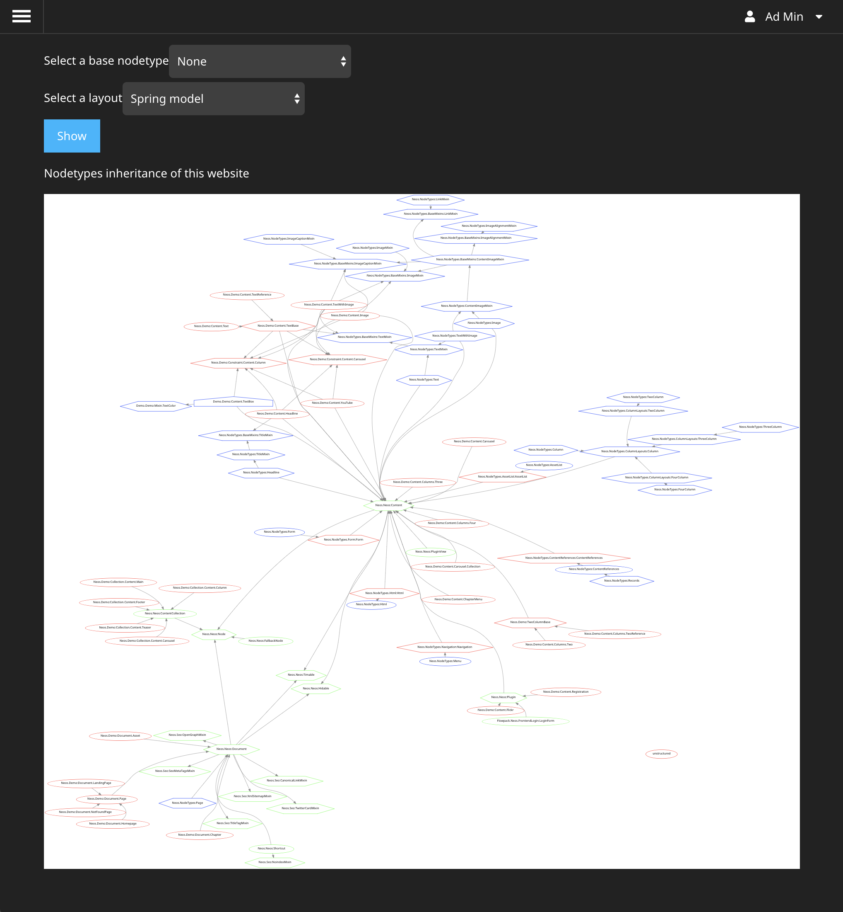

# Neos CMS Content Repository visualizer / debugger

## Installation

    composer require shel/contentrepository-debugger
    
## Usage

### Backend module

You will have an additional backend module `NodeType Analyzer` available in the Neos backend:

It allows you to browser through your nodetypes and render them with different layouts.
Each layout has its own advantages and disadvantages.

### CLI

TODO
