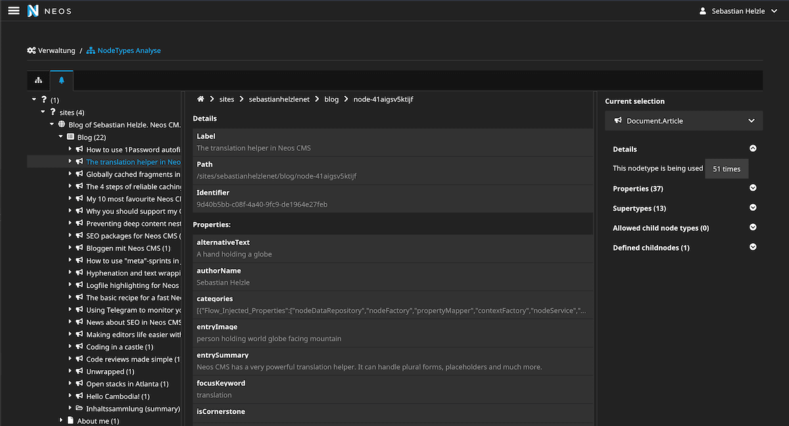

# Neos CMS Content Repository analysis & visualizer


[](https://packagist.org/packages/shel/nodetypes-analyzer)
[](https://packagist.org/packages/shel/nodetypes-analyzer)
[](https://packagist.org/packages/shel/nodetypes-analyzer)

This package allows to output the nodetypes of your Neos CMS project
as various types of graphs via a backend module.

It helps understanding dependencies between packages and nodetypes.
Also it shows which nodetypes are actually being used and can make your
refactoring our code structuring efforts easier.

## Installation

It is recommended to install this package only as development
dependency and not to run it in production except specifically required.

    composer require --dev shel/nodetypes-analyzer
    
## Usage

### Backend module

You will have an additional backend module `NodeType Analyzer` available in the Neos backend:


You can inspect all nodetypes registered in the system and
drill down through your namespaces.

A second graph layout allows your to inspect all direct and indirect dependencies.


You can also explore your complete Content Repository for debugging purposes:



## Additional nodetype annotations

You can set the following options on each nodetype for additional output in the module:

```yaml
My.Vendor:Content.MyNodetype:
  superTypes:
    Neos.Neos:Content: true
  ui:
    label: i18n
  options:
    Shel.NodeTypes.Analyzer:
      deprecated: true
      note: This is someething related to this nodetype
```

### Mark deprecated nodetypes

Marking a nodetype as deprecated will show a warning in the modules inspector and in the nodetype tree.

### Add notes to nodetypes

Adding notes to nodetypes will show them in the module.
 
## Contributing

Contributions are very welcome.

Most of the code is written in TypeScript using React & D3js and can be found in `Resources/Private/JavaScript`.
To make a change first create your own fork, install the package in your Neos project 
and start a new branch. 
Then run `yarn watch` to rebuild the frontend code during development.

A pre commit hook is automatically triggered that will lint the code to make sure
it fulfills our coding guidelines.

Then create a PR from your fork and some tests will automatically check the code quality 
via Github actions.

## Using the package in your projects

When you use the package for commercial projects, please consider funding its development
via the Github sponsor button. Or get in touch with [me](mailto:funding@helzle.it) for other ways of support. 
